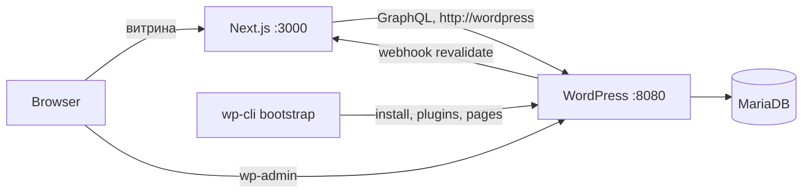

# Сады Наследия: Next.js + WordPress (headless) в Docker

## Решение

**Next.js — витрина, WordPress — только админка.** Это даёт точный стек ТЗ (Tailwind, Framer Motion, Lucide, App Router) и премиальный уровень исполнения, при этом контент правится в привычном WP.

- Витрина: `http://localhost:3000`
- Админка: `http://localhost:8080/wp-admin`
- Фронт самого WordPress отключаем редиректом на `:3000`, чтобы не было «двух сайтов»

## Ключевые решения (изменения относительно первой версии плана)

### 1. Проект живёт вне YandexDisk

Текущая папка `C:\Users\Вячеслав\YandexDisk\РАБОТА\melihov` синхронизируется в облако. Бинд-маунт Docker + `node_modules` + постоянные записи dev-сервера дают медленный hot-reload, конфликты синхронизации и лишний трафик.

- Код: `C:\dev\melihov` (git-репозиторий)
- YandexDisk: только исходники материалов — фото саженцев, видео, тексты, ТЗ
- `node_modules` внутри контейнера — отдельный volume, не бинд-маунт

### 2. Без WooCommerce: модель «заявка», а не «корзина»

Для питомника Woo избыточен и в headless-режиме дорог в поддержке. Вместо него:

- Каталог — собственный тип записи `variety` (сорт саженца)
- Две цены в полях: розничная и оптовая, плюс минимальная партия для опта
- Переключатель «Розница / Опт» на витрине переключает отображаемую цену
- Оформление — форма заявки: выбранные позиции + контакты, письмо менеджеру и запись в WP
- Онлайн-оплата (ЮKassa) — отдельная фаза и только по реальной необходимости

### 3. WPGraphQL с самого начала

Каталог с фильтрами по срокам созревания и регионам на REST потребует много запросов и ручной сборки. Ставим `WPGraphQL` + `WPGraphQL for ACF` сразу, чтобы не переписывать слой данных на фазе 2.

Используем только бесплатный ACF: без repeater и gallery. Галерея фото сорта — прикреплённые к записи вложения, характеристики — таксономии и обычные поля.

### 4. Модель контента — в коде, а не кликами

- Типы записей и таксономии регистрируются в `wordpress/wp-content/mu-plugins/heritage-content.php`
- Группы полей ACF сохраняются в `acf-json/` и лежат в git
- Сервис `wp-cli` при первом запуске сам ставит WordPress, активирует плагины и создаёт базовые страницы — мастер установки руками проходить не нужно

Результат: пересоздание контейнеров не ломает структуру сайта.

### 5. Два адреса WordPress

Классическая ловушка headless в Docker: Next.js на сервере ходит в WP по внутреннему имени сети, а браузер — по внешнему порту.

- `WP_INTERNAL_URL=http://wordpress` — для серверных запросов Next.js
- `NEXT_PUBLIC_WP_URL=http://localhost:8080` — для браузера и ссылок на медиа
- В `lib/wp` нормализуем URL картинок из ответов WP, иначе `next/image` получит недоступный хост
- `WP_HOME` / `WP_SITEURL` фиксируем в переменных окружения

### 6. Правки в админке видны сразу

Без этого редактор меняет текст и не понимает, почему на витрине старый.

- Кеширование через теги Next.js
- mu-plugin на `save_post` дёргает `/api/revalidate` с общим секретом
- Заодно закрывает вопрос предпросмотра черновиков

### 7. Hero-видео: poster-first

Полноэкранное видео легко весит 15+ МБ и портит первую загрузку — для премиум-сайта это обратный эффект.

- Сразу показываем кадр-постер, видео подгружается и включается после готовности
- `muted`, `loop`, `playsInline`, `preload="metadata"`, длительность 8–12 секунд
- На мобильных и при `prefers-reduced-motion` — только статичный кадр
- До получения реальных съёмок сада используем плейсхолдер, замена — без правок кода

## Архитектура



## Структура репозитория

```
C:\dev\melihov\
  docker-compose.yml
  .env / .env.example
  .gitattributes
  wordpress/
    wp-content/
      mu-plugins/heritage-content.php   # типы записей, таксономии, revalidate-хук
      acf-json/                         # поля в git
    uploads.ini                         # лимиты загрузки для фото и видео
  frontend/
    Dockerfile.dev
    app/
      layout.tsx
      page.tsx
      catalog/ services/ about/ info/   # заглушки фазы 1
      api/revalidate/route.ts
    components/
      layout/Header.tsx
      home/Hero.tsx
    lib/wp/                             # GraphQL-клиент, нормализация медиа
    public/                             # постер и плейсхолдер видео
```

## Дизайн-система: «Тёмный престиж» в зелёной гамме

Визуальный язык взят у сайта АТБ-Юг, палитра переведена с сапфира на зелёный.

- Фоны: `#0a1f14` базовый, `#061509` подвал, панели `#12301e`
- Текст: `#edf3ec` основной, `#bfcebf` body, `#94a894` приглушённый
- Золото: `#c5a880` с обязательным металлическим градиентом, плоская заливка запрещена
- Шрифты: Playfair Display в заголовках, Manrope в интерфейсе и тексте, оба с кириллицей
- Компоненты: стеклянные панели, pill-кнопки с бликом, плавающая навигация, подъём карточек на −6px
- Анимации: появление секций `0.85s cubic-bezier(.16,.8,.24,1)`, perf-lite на мобильных

Графическое наполнение описано в [docs/GRAPHICS.md](docs/GRAPHICS.md).

## Фаза 1: окружение и Главная

1. Перенос в `C:\dev\melihov`, `git init`, `.gitattributes` с принудительным LF
2. `docker-compose.yml`: `db` (MariaDB), `wordpress`, `wp-cli` (одноразовый bootstrap), `frontend`
3. Hot-reload в Docker на Windows: `WATCHPACK_POLLING=true`, `node_modules` отдельным volume
4. WP: автоустановка, WPGraphQL + ACF, mu-plugin с типами записей, `uploads.ini` под тяжёлые медиа, редирект фронта WP на `:3000`
5. Next.js: App Router, Tailwind с токенами дизайн-системы, Framer Motion, Lucide, шрифты
6. `lib/wp`: GraphQL-клиент, раздельные internal/public URL, нормализация медиа, `remotePatterns` для `next/image`
7. Header: «Сады Наследия» с подписью «МелиховЪ», пункты Главная, Каталог, Услуги, О питомнике, Покупателям, CTA «Подобрать сад»
8. Hero: poster-first видео, один заголовок, одна фраза, одна группа CTA — без карточек и бейджей поверх видео
9. Каркас секций Главной: УТП и сетка категорий со ссылками на каталог
10. Заглушки маршрутов `/catalog`, `/services`, `/about`, `/info`

## Фаза 2: каталог и контент

- Тип записи `variety`, таксономии: культура, срок созревания, регион, подвой
- Поля: розничная и оптовая цена, минимальная партия, возраст саженца, наличие, правила посадки
- Каталог с фильтрами в сайдбаре и переключателем «Розница / Опт»
- Карточка сорта: крупные фото, описание, правила посадки
- Услуги, О питомнике, Доставка и оплата
- Контакты с картой самовывоза на Яндекс.Картах
- Форма заявки с отправкой менеджеру
- Метаданные, Open Graph, разметка Organization и Product, sitemap, `ru` locale

## Фаза 3: продакшн

- Многоступенчатый `Dockerfile` для Next.js со `standalone`-сборкой
- Отдельный `docker-compose.prod.yml`, реверс-прокси, HTTPS
- Резервное копирование БД и `uploads`
- Онлайн-оплата — только если бизнес подтвердит потребность

## Критерий готовности фазы 1

- `docker compose up` с нуля даёт рабочий стек без ручных шагов в браузере
- Главная на `:3000`: Hero с постером и видео, бренд, работающая навигация
- `wp-admin` на `:8080` открыт, плагины активны, типы записей на месте
- Изменение текста в WP отражается на витрине без перезапуска контейнеров
- Компоненты разделены: `Header`, `Hero`, слой данных изолирован в `lib/wp`
